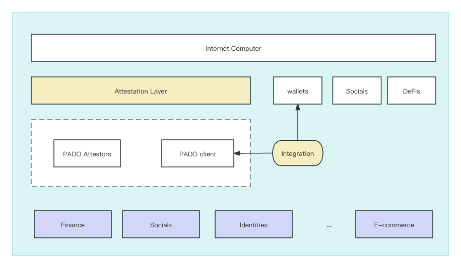

# Enable PADO on Internet Computer 

## About PADO 

### Background
PADO is a zkAttestation protocol, dedicated to bringing Internet data into web3 smart contracts, expanding the capabilities of smart contracts, and enabling the monetization of personal data within data flows under privacy protection. PADO protocol uses advanced cryptography techniques including secure multi-party computation (MPC) and zero-knowledge proofs (ZKP) to fulfill the objectives. In particular, PADO allows users to attest their off-chain data in an authentic and privacy-preserving manner, and tp further create their attestations, a.k.a., data proofs, which can be shared and accessed by other parties. 

In the process of sharing this information, two critical security properties must be guaranteed.

**Authenticity**: It is essential to ensure that user data originates from a specific source and remains unaltered during the sharing process. With PADO, we preserve the data origin and integrity, establishing authenticity.

**Privacy**: Our goal is to handle private information appropriately. Specifically, we adhere to data minimization principles by using zero-knowledge proofs when performing data computations to protect privacy.


### Product

PADO has released a light [product](https://chrome.google.com/webstore/detail/pado/oeiomhmbaapihbilkfkhmlajkeegnjhe) as a Chrome extension. 


## General Architecture


### Technical Architecture

The following figure gives a general idea of how to enable PADO protocol with IC.



In general, one can view PADO protocol as a secure "data bridge", that allows users to create their data proofs(attestations) via Internet data sources, and to submit the proofs to IC. Other dApps can use these data proofs to process with specific logic.

To enable the data-sharing operations, we shall create a public attestation layer with two purposes:
1. Let PADO users store their attestations on IC.
2. Let dApps to access users' attestations.

Also, PADO is a chain-agnostic protocol that supports multiple programmable blockchains. This is the main reason we shall establish a specific attestation layer on IC, which shares similar functionalities like EAS and Verax, but with unique engineering at the backend.

### General Workflow

The following figure shows a general workflow of PADO framework that brings reliable value to user's data for any on-chain application in a compliant and  trust-less way.


In general, PADO uses two cryptographic techniques to combine everything together. 

  * **MPC-TLS**. TLS stands for *transport layer security*, which is a security protocol that provides privacy and data integrity for Internet communications. Any client can communicate with the internet server via TLS protocol to achieve conversation security. A typical example is that, when you explore the website, you usually find there is a "lock" icon and a "https" header in the website URL, and that means the ongoing access is securely protected by TLS. Concisely, MPC-TLS is to simulate an original TLS client, i.e., a PADO attestor will work together with the TLS client to:
    * establish the TLS channel (handshake). This involves the computation of premaster secret, session key, and test messages, etc.
    * query execution in the TLS channel. This involves the generation of encrypted requests and the decryption of the server response. 

    Note all the above TLS-related actions shall be executed in two-party computation (2PC) protocols between the client and the attestor. The design of MPC-TLS protocols relies on a couple of cryptographic primitives, including garbled circuits (GC), oblivious transfer (OT), IZK, etc.  
  
  * **IZK**. Interactive zero-knowledge proof is a type of [zero-knowledge proof](https://en.wikipedia.org/wiki/Zero-knowledge_proof), where the prover and verifier interactively communicate with each other. The IZK protocol will output the verifier's result, i.e., an acceptance or a rejection w.r.t. the prover's statement. IZK protocols possess the benefits that succinct NIZKs (zk-STARKs/zk-SNARKs) do not exhibit, e.g., high scalability to very large statements, cheap computation, avoidance of trusted setup, and minimal use of memory. 

### The Attestation Framework

We shall create PAI (**P**ADO **A**ttestations on **I**C), the public accessible framework for user data attestations.  PADI be used by dapps to store data that is of public interest, aka "attestations", that can be easily accessed and composed together by anyone that's interested. All dapps on that network can issue their attestations to the same place so that they can be easily discovered and consumed.

Attestations are usually statements made by an attestation issuer about something specific. They are also sometimes known as claims or credentials. 

**For issuers of attestations**

If you are a dapp that offers credentials/attestations, you can choose to issue them to PAI. Issuing to PAI gives access to your attestations to any dapp that reads from PAI. Your attestation data becomes widely discoverable and easily consumed, as well as being easily composed with other attestations. Your attestations can start receiving attestations themselves, allowing you to accrue a reputation as a trusted data source.

**For consumers of attestation**

Your dapp can now compose attestations from multiple sources, meaning you no longer have to choose between issuer A or issuer B. You can be sure that users of dapp can prove they are not a bot without being tied to a specific provider. You can start to discover what type of users are interacting with your dapp, and start incentivizing them to onboard with your dapp through issuing attestations yourself.


**Attestation Schemas**

A schema is a blueprint for an attestation. It describes the various fields an attestation contains and what their data types are. Anyone can create a schema in the registry, and once created, schemas can be re-used by anyone else.

Schemas are stored in the registry as a string value that describes the various fields. For example, to create attestations that describe a person, we can create a schema as follows.

`(string username, string teamname, uint16 points, bool active)`

This describes a schema with four fields. Any attestation based on this schema can be decoded in Solidity as follows:


```
(username, teamname, points, active) = abi.decode(   
 attestationData,   
    (string, string, uint16, bool)   
);
```

**Portal Contract**

A "portal" is an entry point into the registry for attestations. All attestations are made through portals. A portal is normally associated with a specific issuer, who would create a portal specifically to issue their attestations with, but portals can also be open to allow anyone to use.

A portal is a smart contract that executes specific verification logic through a chain of modules that attestations run through before being issued to the registry. Portals also have metadata associated with them and can optionally execute lifecycle hooks.


**Registry Contract**

PAI provides three types of registry contracts, including:
* Portal Registry Contract: this contract is to register the portal contracts created by dApps.
* Attestation Registry Contract: this contract receives the submitted attestations from the Portal contract and stores the attestations which can be further accessed by other parties (dApps). This contract will check the availability of the Portal and the Schema with corresponding registry contracts, on any supplied attestations.
* Schema Registry Contract: this contract is to register the specific attestation schema by  dApps.


We show detailed relations of the contracts within PAI in the following figure.


**Modules**

Most dapps will probably want to do a few basic things, like verify a signature, check the data structure of an attestation, and perhaps charge a fee for issuing the attestation. Dapps can do these things using modules, which are small smart contracts that perform simple verification logic. A portal can chain together these modules, and every new attestation goes through each module in the chain, and each module performs a simple check on the attestation. If all modules verify the new attestation successfully, the portal then submits the attestation in the registry.


**Language** 

We will use **Solidity** as the smart contract language, and leverage [Bitfinity](https://docs.bitfinity.network/) as the EVM engine, to create PAI contracts.

## Development Plan
We will make two stages to enable PADO on IC.

1. Stage 1 (~1 month). We will integrate NNS/Stoic/Plug Wallet to allow end users to submit their data attestations as encoded IC transactions to PAI. This will consider the proper browser wallet and the UI/UX integration with the current PADO extension. Note the completion of Stage 1 will be a successful wallet integration and transaction submission to an IC contract.  
2. Stage 2 (~1-2 month). We will implement PAI, and allow users to submit any attestations to IC. This will consider a full implementation of PAI framework, including Portals, Registries, Schemas, and Modules. The PAI is a specific attestation layer for off-chain data storage and access control on IC.


